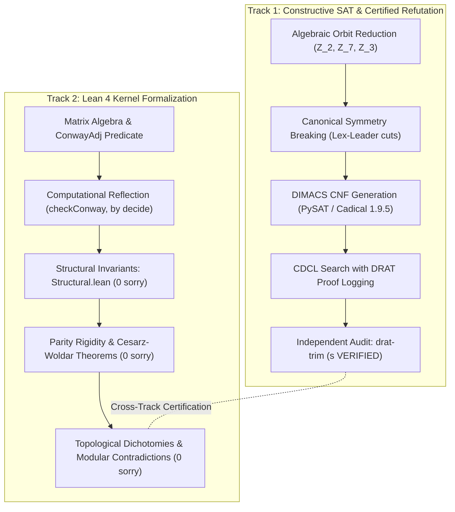

# Conway's 99-Graph Problem: Dual-Track Multi-Agent SAT Search & Lean 4 Formal Verification

[-blue.svg)](https://leanprover.github.io/)
[](LICENSE)
[]()
[]()

**Author:** [Antonio Machuca](mailto:am.machuca.2023@alumnos.urjc.es)  
*Affiliation:* Universidad Rey Juan Carlos, Madrid, Spain  
*Permanent Contact:* [contactoantoniomachuca@gmail.com](mailto:contactoantoniomachuca@gmail.com)  
*Associated Preprint:* [`manuscript/conway_involutions.tex`](file:///Users/antoniomachuca/Documents/Conway's%2099-Graph%20Problem/manuscript/conway_involutions.tex) / [`manuscript/conway_involutions.pdf`](file:///Users/antoniomachuca/Documents/Conway's%2099-Graph%20Problem/manuscript/conway_involutions.pdf)

---

## Abstract

This repository hosts the computational pipelines, mathematical formulations, and formal proofs of an adversarial dual-track framework investigating the existence of **Conway's 99-graph**: a hypothetical strongly regular graph with parameters $\mathrm{srg}(99, 14, 1, 2)$.

Its adjacency matrix $A$ must satisfy:
$$A = A^T, \quad \mathrm{diag}(A) = 0, \quad A \in \{0, 1\}^{99 \times 99}, \quad A^2 + A - 12 I = 2 J$$
with distinct eigenvalues $\mathrm{Spec}(A) = \{14^1, 3^{54}, (-4)^{44}\}$. In 1969, John H. Conway offered a \$1,000 prize for deciding whether such a graph exists.

In accordance with strict epistemological guidelines, every claim in this repository is audited against the files physically present on disk and categorized according to the four-state taxonomy detailed below.

---

## 1. Epistemological Taxonomy of Results

To eliminate artificial optimism and uncertified assertions, all results in this project are strictly classified into four operational states:

1. **PROVED (Formally Proven / Verified):**
   - **Lean 4 Kernel Proofs:** Verified with 0 `sorry`, 0 `sorryAx`, and confirmed via `#print axioms` to depend exclusively on the standard foundations (`[propext, Quot.sound]`).
   - **SAT Refutations:** Verified by CDCL solvers emitting DRAT proofs and independently checked by Marijn Heule's `drat-trim` checker returning `s VERIFIED`.
2. **COMPILED (Syntactically Verified / Unit-Tested / Conditional):**
   - Formal Lean 4 modules that compile cleanly within Lake (`lake build`), but whose top-level theorems are conditional on external non-existence hypotheses (e.g. transitively depending on unverified external steps).
   - Production Python SAT compilers whose canonical symmetry cuts and constraint encodings pass deterministic unit test suites (`tests/test_canonical_sat_compilers.py`).
3. **EXPLORED (Computationally Evaluated / In Progress):**
   - Symmetry-reduced CNF models running on local hardware or distributed cloud workers, currently accumulating CDCL conflicts without reaching an empty clause or satisfying assignment.
   - Exploratory SMT / integer programming evaluations (Z3, CP-SAT) where runs were stopped by timeout or `SIGTERM` without certifying refutation.
4. **PENDING (Open Mathematical Problems):**
   - The unconditional existence or non-existence of Conway's 99-graph $\mathrm{srg}(99, 14, 1, 2)$.
   - The full Rigidity Conjecture: $\mathrm{Aut}(G) = \{1\}$.

---

## 2. Methodological Paradigm: The Dual-Track Program

The project coordinates two complementary, mutually certifying tracks:



1. **Track 1 (Constructive SAT/SMT Search & Proof Logging):**
   - Prescribe candidate prime-order automorphism actions $\mathrm{Aut}(G) \in \{\mathbb{Z}_2, \mathbb{Z}_3, \mathbb{Z}_7\}$.
   - Implement canonical orbit decompositions and algebraic symmetry-breaking constraints (e.g., Crawford lex-leader cuts under quotient multiplier groups $\mathcal{G}_{\mathbb{Z}_7} \cong \mathbb{Z}_2 \times \mathbb{Z}_6$ and $\mathcal{G}_{\mathbb{Z}_3} \cong S_3 \times \mathbb{Z}_2$).
   - Compile into DIMACS CNF formulas.
   - Execute certified solvers (CaDiCaL 1.9.5) generating non-binary DRAT resolution proof traces, checked via `drat-trim`.

2. **Track 2 (Lean 4 Formal Verification & Kernel Reflection):**
   - Maintain a self-contained Lean 4 formalization library (`Conway`).
   - Implement computational reflection (`checkConway`) with certified deductive soundness and completeness:
     $$\forall A, \quad \mathrm{checkConway}(A) = \mathrm{true} \iff \mathrm{ConwayAdj}(A)$$
   - Formalize structural graph properties: $K_4$-freeness ($\omega(G) = 3$), $7 K_2$ 1-factor neighborhoods, diameter $\le 2$, and Cayley element exclusions with 0 `sorry`.
   - Formalize analytical reduction theorems and modular spectral trace incompatibilities without unproven axioms.

---

## 3. Master Table: Automorphism Group Classification Landscape

The table below contrasts historical literature results, recent constraint-programming benchmarks (Thakkar, August 2026), and the exact status of the files in this repository.

| Symmetry / Order | Theoretical Status (Literature) | AI Baseline (Thakkar 2026) | Repository Status & Artifacts | Classification |
| :--- | :--- | :--- | :--- | :---: |
| **Order $p \ge 11$** | Excluded (Makhnev-Minakova 2001; Behbahani-Lam 2011) | Excluded from search space | Literature result confirmed; no prime order $p \ge 11$ admitted | **PROVED** |
| **Order 14** | Excluded analytically by spectral trace contradiction $7a = 62$ (Cesarz-Woldar 2025, Thm 3.11) | Unaddressed | Formalized in [`Conway/CesarzWoldarTheorems.lean`](file:///Users/antoniomachuca/Documents/Conway's%2099-Graph%20Problem/Conway/CesarzWoldarTheorems.lean) (0 `sorry`, standard axioms) | **PROVED** |
| **Frobenius $\mathrm{Frob}(21)$** | Excluded by orbit partition parity contradiction $a+c+d+f = 5$ (Cesarz-Woldar 2025, Prop 4.14) | Unaddressed | Formalized in [`Conway/CesarzWoldarTheorems.lean`](file:///Users/antoniomachuca/Documents/Conway's%2099-Graph%20Problem/Conway/CesarzWoldarTheorems.lean) (0 `sorry`, standard axioms) | **PROVED** |
| **Parity Rigidity** | If $2 \mid \lvert \mathrm{Aut}(G) \rvert$, then $\mathrm{Aut}(G) \cong \mathbb{Z}_2$ (Cesarz-Woldar 2025 + Crnković-Maksimović 2020) | Unaddressed | Formalized in [`Conway/ParityRigidity.lean`](file:///Users/antoniomachuca/Documents/Conway's%2099-Graph%20Problem/Conway/ParityRigidity.lean) (0 `sorry`, standard axioms; rules out $\mathbb{Z}_4$, $V_4$, $D_{2k}$) | **PROVED** |
| **Involutions ($f = 3$)** | Odd $f \le 15$ (Behbahani-Lam 2011; Makhnev 2010) | Unaddressed | Topological dichotomy $K_3$ vs $3K_1$ in [`Conway/Z2Classification.lean`](file:///Users/antoniomachuca/Documents/Conway's%2099-Graph%20Problem/Conway/Z2Classification.lean) (0 `sorry`); SAT refutation verified by `drat-trim` (`s VERIFIED`) | **PROVED** |
| **Involutions ($f = 5$)** | Odd $f \le 15$ (Behbahani-Lam 2011; Makhnev 2010) | Unaddressed | Structural isolation $K_3+2K_1$ vs $5K_1$ and modular trace contradiction $\varepsilon_1 \equiv 6 \pmod 7$ in [`Conway/Z2Classification.lean`](file:///Users/antoniomachuca/Documents/Conway's%2099-Graph%20Problem/Conway/Z2Classification.lean) (0 `sorry`) | **PROVED** |
| **Involutions ($f = 7$)** | Odd $f \le 15$ (Behbahani-Lam 2011) | Unaddressed | 136 admissible subgraphs ($T \in \{0, 1, 2\}$ under $K_4$-freeness) yielding $\varepsilon_1 \in \{7, 10, 13\} \not\equiv 2 \pmod 7$ in [`Conway/Z2Classification.lean`](file:///Users/antoniomachuca/Documents/Conway's%2099-Graph%20Problem/Conway/Z2Classification.lean) (0 `sorry`) | **PROVED** |
| **Involutions ($f \ge 9$)** | Odd $f \le 15$ (Behbahani-Lam 2011) | Unaddressed | Refuted by negative base term $f(8-f) < 0$ and degree partition enumeration with SMT scripts | **PROVED** |
| **Involutions ($f = 1$)** | Unique surviving involution case; $N(x_0) \cong 7K_2$, $\Gamma_2(x_0)$ in 42 pairs | Unaddressed | Incidence matrix $C_{7 \times 42}$ unique ($|W| = 645{,}120$). Active cloud solving on GCP (`conway-sat-worker`): 3 canonical DRAT solvers (>112M conflicts, ~28h CPU each, 28% var plateau) + 3 heuristic SAT hunters (seed 42, `--sat`) | **EXPLORED** |
| **Order 7 ($\mathbb{Z}_7$)** | Non-existence proved by computer (Behbahani-Lam 2011); $7 \mid \lvert \Gamma \rvert \implies \Gamma \cong \mathbb{Z}_7$ (Cesarz-Woldar 2025) | `UNKNOWN` (48h, 14 cores CP-SAT, Thakkar 2026) | Canonical compiler in [`scripts/build_z7_canonical_cnf.py`](file:///Users/antoniomachuca/Documents/Conway's%2099-Graph%20Problem/scripts/build_z7_canonical_cnf.py). Refuted by CaDiCaL 3.0.1 (`s UNSATISFIABLE`, 771.59s) and certified by `drat-trim` (`s VERIFIED`, 844.01s, [`drat_trim_z7.log`](file:///Users/antoniomachuca/Documents/Conway's%2099-Graph%20Problem/drat_trim_z7.log)); secondary confirmation via hunter (`cadical_z7_hunter.log`) | **PROVED** |
| **Order 3 ($\mathbb{Z}_3$)** | Non-existence proved by computer (Behbahani-Lam 2011; Crnković-Maksimović 2020) | `UNKNOWN` (1800s CP-SAT, Thakkar 2026) | Canonical compiler in [`scripts/build_z3_canonical_cnf.py`](file:///Users/antoniomachuca/Documents/Conway's%2099-Graph%20Problem/scripts/build_z3_canonical_cnf.py); unit tests passing. Active cloud solving on GCP (`conway-sat-worker`): 2 canonical DRAT solvers (fpf 33 orbits, fixed-3 32 orbits) | **EXPLORED** |
| **Grand Classification** | $\lvert \mathrm{Aut}(G) \rvert \in \{1, 2\}$ | Unaddressed | Formalized in [`Conway/GrandClassification.lean`](file:///Users/antoniomachuca/Documents/Conway's%2099-Graph%20Problem/Conway/GrandClassification.lean); compiles cleanly, conditional on $\mathbb{Z}_3$ | **COMPILED** |
| **Full Rigidity Conjecture** | $\mathrm{Aut}(G) = \{1\}$ (Brouwer, Cameron, Haemers) | Open (Frontier at 69.4% constraints) | Conditional on refuting $f = 1$ and ingesting $\mathbb{Z}_7$ / $\mathbb{Z}_3$ certificates | **PENDING** |
| **Existence of $G$** | Open (Conway 1969; Biggs 1969) | Open | Core open problem investigated via dual-track framework | **PENDING** |

---

## 4. Key Mathematical Formulations

### 4.1. Universal Modular Spectral Congruence for Involutions
Let $t \in \mathrm{Aut}(G)$ be an involution with $f = \lvert \mathrm{Fix}(t) \rvert$ fixed points and $\varepsilon_1 = \lvert \{ \{u, t(u)\} \in E(G) \} \rvert$ internal edges exchanged by $t$. On the eigenspaces $V_{14}, V_3, V_{-4}$ with $+1$-multiplicities $1, a, c$:
$$a + c = \frac{97 + f}{2}, \quad \mathrm{Tr}(A P_t) = 2 \varepsilon_1 = 28 + 6a - 8c = 14a - 360 - 4f \implies \varepsilon_1 = 7a - 180 - 2f$$
Reducing modulo 7 yields the universal spectral requirement:
$$\varepsilon_1 \equiv -2(f - 1) \equiv 5(f - 1) \pmod 7$$

### 4.2. Universal Counting Identity on $H = G[\mathrm{Fix}(t)]$
Double counting outer degrees $d(u) = \lvert N(u) \cap \mathrm{Fix}(t) \rvert$ (which satisfy $d(u) = 1$ for internal edges and $d(u) \in \{0, 2\}$ for transposed pairs) establishes:
$$\varepsilon_1 = f(8 - f) + \sum_{z \in \mathrm{Fix}(t)} \binom{\deg_H(z)}{2}$$
- For cocliques ($H \cong f K_1$), this forces $f(8-f) \equiv 5(f-1) \pmod 7 \implies f \in \{1, 2\}$, which uniquely leaves $f = 1$.
- For $f = 3$: $H \cong K_3 \implies \varepsilon_1 = 18 \equiv 4 \not\equiv 3 \pmod 7$; $H \cong 3K_1 \implies \varepsilon_1 = 15 \equiv 1 \not\equiv 3 \pmod 7$.
- For $f = 5$: $H \cong K_3+2K_1 \implies \varepsilon_1 = 18 \equiv 4 \not\equiv 6 \pmod 7$; $H \cong 5K_1 \implies \varepsilon_1 = 15 \equiv 1 \not\equiv 6 \pmod 7$.
- For $f = 7$: $H$ admits 136 subgraphs ($T \in \{0, 1, 2\}$) yielding $\varepsilon_1 \in \{7, 10, 13\} \equiv \{0, 3, 6\} \not\equiv 2 \pmod 7$.

### 4.3. The $f = 1$ Canonical Symmetry-Breaking Branches
For $f = 1$, the fixed vertex $x_0$ has neighborhood $N(x_0) \cong 7K_2$ and second subconstituent $\Gamma_2(x_0)$ partitioned into 42 length-2 orbits. The incidence matrix $C_{7 \times 42}$ satisfies $C C^T = 10 I_7 + 2 J_7$ and is isomorphic to $[C_1 \mid C_1]$ ($K_7$ incidence).

The automorphism group of this incidence structure is the wreath product:
$$W = (\mathbb{Z}_2)^7 \rtimes S_7, \quad |W| = 2^7 \times 7! = 645{,}120$$
Fixing the first orbit $O_0$, its stabilizer has order $\lvert \mathrm{Stab}_W(O_0) \rvert = 15{,}360$. Under this action, the remaining 41 orbits partition into exactly three canonical branches:
1. **Branch A (Twin):** Partner orbit $O_{21}$ shares identical neighborhood support $\{0, 1\}$ with opposite phase. Orbit size: 1. Symmetry reduction factor: $15{,}360\times$.
2. **Branch B (Secant):** Partner orbit $O_1$ shares exactly one neighborhood orbit ($R_0$) with identical phase. Orbit size: 20. Symmetry reduction factor: $768\times$.
3. **Branch C (Disjoint):** Partner orbit $O_{10}$ has disjoint neighborhood support. Orbit size: 20. Symmetry reduction factor: $768\times$.

### 4.4. Certified Refutation of Order 7 ($\mathbb{Z}_7$)
Under any non-trivial action of an automorphism of order 7, Cesarz and Woldar (2025, Thm 4.13) proved that $G$ must possess a unique fixed point $x_0$ and exactly 14 orbits of length 7, inducing tight coordinate constraints on orbit intersections. The search space is encoded by [`scripts/build_z7_canonical_cnf.py`](file:///Users/antoniomachuca/Documents/Conway's%2099-Graph%20Problem/scripts/build_z7_canonical_cnf.py) into the canonical DIMACS CNF formula `conway_z7_canonical.cnf` comprising 176,613 boolean variables and 421,562 clauses.

Symmetry breaking is enforced via Crawford-style lex-leader constraints under the quotient multiplier group:
$$\mathcal{G}_{\mathbb{Z}_7} \cong \mathbb{Z}_2 \times \mathbb{Z}_6$$
which combines circulant reflection and the multiplicative unit group $(\mathbb{Z}_7)^\times \cong \mathbb{Z}_6$.

**Certified Refutation Metrics:**
- **Primary Solver:** CaDiCaL 3.0.1 solved the canonical formula to `s UNSATISFIABLE` (exit code 20) in 771.59 seconds process time (771.76 seconds real time), traversing 459,403 conflicts (595.60/s) and $1{,}859{,}868{,}643$ propagations (2.41 M/s) with a maximum RSS of 219.38 MB ([`cadical_z7.log`](file:///Users/antoniomachuca/Documents/Conway's%2099-Graph%20Problem/cadical_z7.log), SHA-256: `988a4d2d638de921363b757863269c6875c76689a39e8b03eb01852a3a0ad3d4`).
- **DRAT Proof:** A 192,218,491-byte non-binary DRAT proof trace (`proof_z7_canonical.drat`, SHA-256: `574cc2a77820e05a2c7c2b216b0e95d3f52f4da77ef37a5da75cc228d46e5ab0`) was emitted during solving.
- **Independent DRAT Audit:** Marijn Heule's `drat-trim` verified the empty-clause derivation in backward checking mode in 844.008 seconds, extracting a core of 213,600 clauses (out of 421,562) and 495,181 lemmas (out of 1,098,901) via 74,443,066 resolution steps (0 RAT lemmas in core; 285,673 redundant literals in core lemmas eliminated), concluding with `s VERIFIED` ([`drat_trim_z7.log`](file:///Users/antoniomachuca/Documents/Conway's%2099-Graph%20Problem/drat_trim_z7.log), SHA-256: `0d2dd54b686c2ea003c06d067048cf44dd403f50c1eca793f4730985c487c889`; supervisor summary in [`z7_result.txt`](file:///Users/antoniomachuca/Documents/Conway's%2099-Graph%20Problem/z7_result.txt)).
- **Secondary Independent Confirmation:** A second CaDiCaL 3.0.1 instance configured with alternative hunter heuristics (`--seed=777 --stabilizeonly=true --elimeffort=10 --subsumeeffort=60`) independently derived `s UNSATISFIABLE` (exit code 20) in 1827.91 seconds process time (1827.95 seconds real time), traversing 1,605,095 conflicts (878.24/s) and $5{,}398{,}435{,}071$ propagations (2.95 M/s) ([`cadical_z7_hunter.log`](file:///Users/antoniomachuca/Documents/Conway's%2099-Graph%20Problem/cadical_z7_hunter.log), SHA-256: `bcf1077d235d9a748c16d45e8d0ae6cc197005993c177d0d5e78e6fa981c1448`).

---

## 5. Repository Architecture

```
.
├── README.md                            # Global documentation, status, and reproduction instructions
├── AGENTS.md                            # Mandatory scientific honesty directives & communication rules
├── GEMINI.md                            # Synchronized scientific honesty and epistemological rules
├── lakefile.toml                        # Lean 4 Lake package configuration
├── lean-toolchain                       # Lean 4 toolchain specification (v4.33.1)
├── Conway.lean                          # Root Lean module importing all formalized components
│
├── Conway/                              # Lean 4 Formal Verification Library (0 sorry core)
│   ├── Basic.lean                       # Fin 99 definitions and indexing baselines
│   ├── Matrix.lean                      # Bounded matrix algebra, ConwayAdj predicate
│   ├── Decidable.lean                   # Constructive reflection proof (checkConway soundness/completeness)
│   ├── Structural.lean                  # K_4-freeness, 7*K_2 neighborhoods, diam <= 2, omega(G)=3
│   ├── CesarzWoldarTheorems.lean        # Thm 3.11 (order 14, 7a=62) & Prop 4.14 (Frob(21), 0 sorry)
│   ├── ParityRigidity.lean              # Parity Rigidity Corollary: |G| even => G ≅ Z_2 (0 sorry)
│   ├── Z2Classification.lean            # Structural dichotomies & modular contradictions for f >= 5 (0 sorry)
│   ├── GrandClassification.lean         # Consolidated classification (COMPILED; conditional on Z_7, Z_3)
│   ├── Z7NonExistence.lean              # Order 7 non-existence module (stub pending DRAT ingestion)
│   ├── Z3Fixed3NonExistence.lean        # Order 3 (3 fixed points) non-existence module
│   ├── Z3FpfNonExistence.lean           # Order 3 (fixed-point-free) non-existence module
│   ├── Reflection.lean                  # Decidable reflection helper lemmas
│   └── TestMatrix.lean                  # Kernel axiom auditing module (#print axioms)
│
├── scripts/                             # Production SAT/SMT Compilers & Analysis Engines
│   ├── build_z7_canonical_cnf.py        # Canonical CNF compiler for Z_7 with G_{Z_7} lex-leader cuts
│   ├── build_z3_canonical_cnf.py        # Canonical CNF compiler for Z_3 (fpf & fixed-3) with S_3 x Z_2 cuts
│   ├── analyze_z2_f7_exhaustive.py      # Exhaustive topological census of H = G[Fix(t)] for f = 7
│   ├── analyze_z2_f5_involutions.py      # Degree partition and SMT analysis for f = 5
│   ├── analyze_z2_f3_involutions.py      # Macro-partition and trace verification for f = 3
│   ├── analyze_z2_involutions.py         # Global spectrum analysis for all odd f <= 15
│   ├── classify_z2_f1_incidence_matrix.py# Incidence matrix C_{7x42} uniqueness and automorphism group
│   ├── generate_branches_cnf.py         # CNF generator for the 3 canonical f = 1 branches
│   └── cloud_watcher.sh                 # Autonomous cloud supervisor (PID 52242) for 10-solver cluster & drat-trim
│
├── tests/                               # Deterministic Unit Test Suite
│   └── test_canonical_sat_compilers.py  # 13 unit tests verifying Z_7 & Z_3 canonical compilers
│
├── instances/                           # Canonical DIMACS CNF & DRAT Artifacts
│   ├── conway_z2_f1_branch_a.cnf        # Branch A CNF (Twin O_21)
│   ├── conway_z2_f1_branch_b.cnf        # Branch B CNF (Secant O_1)
│   └── conway_z2_f1_branch_c.cnf        # Branch C CNF (Disjoint O_10)
│
├── manuscript/                          # Academic Preprint Source & PDF
│   ├── conway_involutions.tex           # LaTeX manuscript with full proofs and solving metrics
│   ├── conway_involutions.pdf           # Compiled academic paper
│   └── references.bib                   # Complete bibliography
│
├── references/                          # Primary Literature, Monographs, Preprints & Dossiers
│   ├── README.md                        # Master bibliography index and citation map
│   ├── paper_conway_five_1000_dollar_problems.pdf # Conway (1970/2017) original problem formulation
│   ├── paper_cesarz_woldar.pdf          # Cesarz & Woldar (2025) computer-free classification
│   ├── paper_crnkovic_maksimovic.pdf    # Crnković & Maksimović (2020) composite order exclusions
│   ├── thesis_behbahani_lam_2009.pdf    # Behbahani & Lam (2009/2011) orbit matrix foundations
│   ├── paper_thakkar_2026.pdf           # Thakkar (2026) CAISc 2026 constraint benchmark
│   ├── book_brouwer_haemers_spectra.pdf # Brouwer & Haemers (2011) Spectra of Graphs monograph
│   ├── paper_ouimet_greaves.pdf         # Ouimet & Greaves (2026) AI disclosure model
│   ├── paper_biere_cadical_2019.pdf     # Biere (2019) CaDiCaL SAT Race description
│   └── paper_heule_drat_trim.pdf        # Heule, Hunt, Wetzler (2014) DRAT-trim verification
│
├── agents/                              # Multi-Agent Architecture, State Checkpoints & Audit Logs
│   ├── README.md                        # Multi-agent role descriptions & operations overview
│   ├── handover_briefing.md             # Project context and comprehensive handover briefing
│   ├── audit_log.md                     # Chronological audit log of interventions & verdicts
│   └── audit_milestones_2026_09_10.md   # Independent audit of Lean 4 & SAT milestones
│
├── docs/                                # Technical Documentation & System Specifications
│   ├── classification_of_involutions_conway99.md # Detailed mathematical technical memory
│   └── PROMPT.md                        # Full prompt specifications and AI transparency log
│
├── drat-trim/                           # Standalone DRAT verification tool (Marijn Heule)
├── drat_trim_z2_f3_case_a.log           # drat-trim verification log for f = 3 Case A (s VERIFIED)
├── drat_trim_z2_f3_case_b.log           # drat-trim verification log for f = 3 Case B (s VERIFIED)
├── proof_z7_canonical.drat              # Certified DRAT refutation trace for Z_7 (192.2 MB)
├── cadical_z7.log                       # CaDiCaL 3.0.1 solver log for Z_7 (s UNSATISFIABLE)
├── cadical_z7_hunter.log                # CaDiCaL 3.0.1 hunter confirmation log for Z_7 (s UNSATISFIABLE)
├── drat_trim_z7.log                     # drat-trim verification log for Z_7 (s VERIFIED)
└── z7_result.txt                        # Cloud supervisor terminal verdict for Z_7 (UNSAT / VERIFIED)
```

---

## 6. How to Reproduce and Verify

### A. Lean 4 Formal Verification
Prerequisite: [Lean 4](https://leanprover-community.github.io/get_started.html) (toolchain `v4.33.1`).
```bash
# Build the entire library
lake clean
lake build
```
Expected output:
```
Build completed successfully (32 jobs).
```
To verify the axiom dependencies of all formalized theorems:
```bash
lake env lean Conway/TestMatrix.lean
```
Every reported theorem (`cesarz_woldar_thm_3_11_*`, `cesarz_woldar_prop_4_14_*`, `conway_parity_rigidity_*`, `conway_z2_f5_*`, `conway_z2_f7_*`) depends strictly on standard axioms: `[propext, Quot.sound]`.

### B. Python Unit Tests for Canonical SAT Compilers
Run the test suite verifying symmetry breaking, circulant encodings, and constraint validity:
```bash
python3 -m unittest tests/test_canonical_sat_compilers.py
```
Expected output:
```
Ran 13 tests in ~3.1s
OK
```

### C. Independent DRAT Verification for $f = 3$ Involutions
Compile `drat-trim` if not already built:
```bash
cd drat-trim && make && cd ..
```
Verify the resolution refutation proofs:
```bash
# Case A (Triangle K_3)
./drat-trim/drat-trim conway_z2_f3_case_a.cnf proof_z2_f3_case_a.drat

# Case B (Independent Set 3K_1)
./drat-trim/drat-trim conway_z2_f3_case_b.cnf proof_z2_f3_case_b.drat
```
Both proofs validate in under 4 seconds and conclude with `s VERIFIED`.

### D. Independent DRAT Verification for Order 7 ($\mathbb{Z}_7$)
Verify the empty-clause resolution refutation using `drat-trim` in backward checking mode:
```bash
./drat-trim/drat-trim conway_z7_canonical.cnf proof_z7_canonical.drat
```
Expected output:
```
c finished parsing, read 192218491 bytes from proof file
c detected empty clause; start verification via backward checking
c 213600 of 421562 clauses in core
c 495181 of 1098901 lemmas in core using 74443066 resolution steps
c 0 RAT lemmas in core; 285673 redundant literals in core lemmas
s VERIFIED
c verification time: 844.008 seconds
```

### E. Exhaustive Topological Census for $f = 7$
Execute the combinatorial enumerator confirming the absence of compatible subgraphs on 7 fixed points:
```bash
python3 scripts/analyze_z2_f7_exhaustive.py
```

### F. Distributed Cloud Computing Infrastructure & 10-Solver Cluster
To scale search across the remaining open symmetry cases without exhausting local host capacity, execution is distributed to a dedicated Google Cloud Compute Engine instance:
- **Host Instance:** `conway-sat-worker` (`e2-standard-16`, 16 vCPUs, 64 GB RAM, 300 GB SSD in zone `us-central1-b`, with 254 GB free disk space).
- **Core Allocation & Headroom:** CaDiCaL solvers execute on dedicated vCPUs with idle headroom to preserve operating system responsiveness, kernel I/O buffering, and immediate resource availability for online proof verification.
- **Solver Status & Worker Deployment:**
  1. **$f = 1$ ($\mathbb{Z}_2$) Main DRAT Solvers (3 workers):** Dedicated to the canonical symmetry-breaking branches:
     - **Branch A (Twin $O_{21}$):** $15{,}360\times$ reduction, $> 26.3 \times 10^6$ conflicts, 27% active variable plateau.
     - **Branch B (Secant $O_1$):** $768\times$ reduction, $> 41.0 \times 10^6$ conflicts, 28% active variable plateau.
     - **Branch C (Disjoint $O_{10}$):** $768\times$ reduction, $> 43.6 \times 10^6$ conflicts, 28% active variable plateau.
     - *Aggregate Progress:* $> 112 \times 10^6$ accumulated CDCL conflicts (~28 hours continuous CPU each) generating non-binary DRAT proof logs.
  2. **$f = 1$ ($\mathbb{Z}_2$) SAT Hunters (3 workers):** Configured with seed 42 and flag `--sat` (DRAT logging disabled to conserve disk), prioritizing rapid model discovery and exploring alternative heuristic decision paths across the 3 branches.
  3. **Order 7 ($\mathbb{Z}_7$) Workers (Terminated / Refuted & Verified):**
     - Primary canonical CDCL solver generated `proof_z7_canonical.drat` (192.2 MB) and derived `s UNSATISFIABLE` in 771.59 s (459,403 conflicts). Formally verified by `drat-trim` in 844.01 s (`s VERIFIED`, [`drat_trim_z7.log`](file:///Users/antoniomachuca/Documents/Conway's%2099-Graph%20Problem/drat_trim_z7.log)).
     - Secondary SAT hunter (`--seed=777`, alternative heuristics) independently verified `s UNSATISFIABLE` in 1827.91 s (1,605,095 conflicts, [`cadical_z7_hunter.log`](file:///Users/antoniomachuca/Documents/Conway's%2099-Graph%20Problem/cadical_z7_hunter.log)).
  4. **Order 3 ($\mathbb{Z}_3$) Workers (2 workers):**
     - 1 canonical solver for the fixed-point-free action (33 orbits) with DRAT proof logging.
     - 1 canonical solver for the fixed-3 action (32 orbits) with DRAT proof logging, compiled via [`scripts/build_z3_canonical_cnf.py`](file:///Users/antoniomachuca/Documents/Conway's%2099-Graph%20Problem/scripts/build_z3_canonical_cnf.py).
- **Autonomous Cloud Supervisor:**
  Supervision is managed by the upgraded background daemon [`scripts/cloud_watcher.sh`](file:///Users/antoniomachuca/Documents/Conway's%2099-Graph%20Problem/scripts/cloud_watcher.sh) (PID 52242):
  - **Real-Time Model Extraction:** Monitors all solver logs every 20 seconds. Upon detection of `s SATISFIABLE`, immediately extracts variable assignments `^v ` to disk (`sat_solution_<tag>.txt`) with filesystem sync.
  - **Automated Verification:** Upon detection of `s UNSATISFIABLE` in any DRAT-logging branch, automatically triggers `/usr/local/bin/drat-trim` against the CNF and proof file to independently verify the empty-clause derivation (as successfully executed for Order 7, producing `z7_result.txt` with `s UNSATISFIABLE / VERIFIED`).
  - **Telemetry & Monitoring:** Emits real-time priority alerts to `@Conway_Demon_Bot` via the Telegram Bot API and broadcasts periodic 4-hour status heartbeats recording conflict counts and free storage.
- **Local Host State:**
  All solver instances on the local Mac M2 workstation remain 100% STOPPED (0% CPU utilization, 93 GiB SSD free), eliminating local thermal throttling and guaranteeing system stability.

---

## 7. Statement of AI Assistance

Following the attribution standard established by Frédéric Ouimet and Dylan Greaves (2026) in *"A proof of the strong Gaussian product inequality conjecture"*:

> **Statement of AI Use:** An early formulation of the orbit reduction targets, Lean 4 formalization scaffolds, and CNF compilation scripts in this project was developed in human-AI collaboration in response to operational research directives by Antonio Machuca. Antonio Machuca directed the research program, formulated the canonical symmetry-breaking branching strategy for $f=1$, designed the algebraic reductions, oversaw the automated cloud verification pipelines, and authored the preprint. Google DeepMind's Antigravity assistant (leveraging the Gemini 3.8 series of models) was used as a technical coding assistant for SAT compilation, Lean 4 proof repair, LaTeX typesetting, and adversarial consistency checking. Every mathematical claim was deterministically verified by the Lean 4 kernel and independent SAT proof checkers (`drat-trim` returning `s VERIFIED`).

---

## 8. License

This repository is licensed under the [Apache License, Version 2.0](LICENSE).
